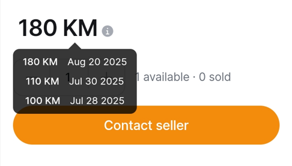
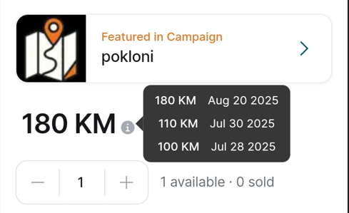
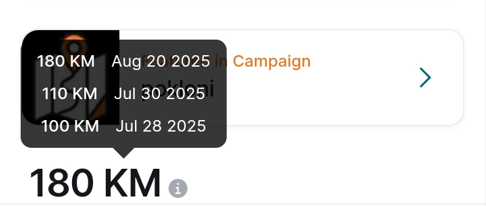
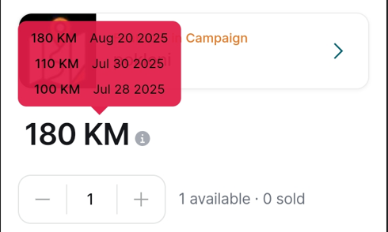
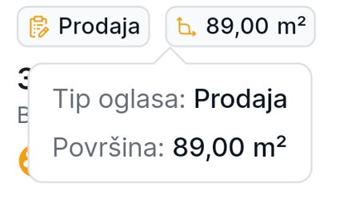

# DFTooltip

A highly customizable and intelligent Flutter tooltip widget that automatically adjusts its position based on available space. Perfect for displaying contextual information without cluttering your UI.

## 🎯 Features

- **Smart Positioning**: Automatically adjusts tooltip position based on available screen space
- **Multiple Directions**: Support for up, down, left, and right positioning
- **Auto-hide on Scroll**: Intelligently hides when user scrolls, perfect for scrollable content
- **Customizable Appearance**: Full control over colors, borders, border radius, and dimensions
- **Border Support**: Add custom borders with configurable color and width
- **Arrow Customization**: Customize arrow size and appearance
- **Flexible Sizing**: Different width options for vertical vs horizontal tooltips
- **Auto-dismiss**: Optional auto-hide with customizable duration
- **Tap to Dismiss**: Click anywhere outside to hide the tooltip
- **Overflow Protection**: Ensures tooltips never go off-screen

### Screenshots

| Feature | Screenshot |
|---------|------------|
| **Basic Tooltip Bottom** |  |
| **Different Directions - Right** |  |
| **Changes position if there is no space** |  |
| **Styling** |  |
| **Border support** |  |

## 📦 Installation

Add this to your package's `pubspec.yaml` file:

```yaml
dependencies:
  df_tooltip: ^0.0.2
```

Then run:

```bash
flutter pub get
```

## 🚀 Getting Started

Import the package in your Dart file:

```dart
import 'package:df_tooltip/df_tooltip.dart';
```

## 💡 Usage

### Basic Example

```dart
DFTooltip(
  content: Text(
    'This is a tooltip!',
    style: TextStyle(color: Colors.white),
  ),
  child: ElevatedButton(
    onPressed: () {},
    child: Text('Hover me'),
  ),
)
```

### Advanced Example with Custom Styling

```dart
DFTooltip(
  content: Container(
    padding: EdgeInsets.all(8),
    child: Column(
      mainAxisSize: MainAxisSize.min,
      children: [
        Icon(Icons.info, color: Colors.white),
        SizedBox(height: 4),
        Text(
          'Custom styled tooltip with icon',
          style: TextStyle(color: Colors.white),
        ),
      ],
    ),
  ),
  preferredDirection: TooltipDirection.up,
  bgColor: Colors.blue.withOpacity(0.9),
  borderRadius: BorderRadius.circular(12),
  borderColor: Colors.white,
  borderWidth: 2.0,
  arrowHeight: 10.0,
  arrowWidth: 20.0,
  margin: 8.0,
  duration: Duration(seconds: 3),
  sideTooltipWidth: 200,
  child: IconButton(
    icon: Icon(Icons.help_outline),
    onPressed: () {},
  ),
)
```

### In a Scrollable List

```dart
ListView.builder(
  itemCount: 20,
  itemBuilder: (context, index) {
    return ListTile(
      title: Text('Item $index'),
      trailing: DFTooltip(
        content: Text(
          'This tooltip will auto-hide when you scroll!',
          style: TextStyle(color: Colors.white),
        ),
        preferredDirection: TooltipDirection.left,
        child: Icon(Icons.info_outline),
      ),
    );
  },
)
```

## 🔧 Customization Options

### Constructor Parameters

| Parameter | Type | Default | Description |
|-----------|------|---------|-------------|
| `child` | `Widget` | required | The widget that triggers the tooltip |
| `content` | `Widget` | required | The content displayed inside the tooltip |
| `preferredDirection` | `TooltipDirection` | `TooltipDirection.up` | Preferred direction (auto-adjusts if no space) |
| `showOnTap` | `bool` | `true` | Whether to show tooltip on tap |
| `duration` | `Duration?` | `null` | Auto-hide duration (null = manual hide only) |
| `margin` | `double` | `0.0` | Space between tooltip and target widget |
| `sideTooltipWidth` | `double?` | `null` | Custom width for left/right tooltips |
| `upnDownTooltipWidth` | `double?` | `null` | Custom width for up/down tooltips |
| `bgColor` | `Color?` | `Color(0xCC000000)` | Background color of the tooltip |
| `borderRadius` | `BorderRadius?` | `BorderRadius.circular(8)` | Border radius of the tooltip |
| `borderColor` | `Color?` | `null` | Border color (requires borderWidth) |
| `borderWidth` | `double?` | `null` | Border width (requires borderColor) |
| `arrowHeight` | `double` | `8.0` | Height of the tooltip arrow |
| `arrowWidth` | `double` | `16.0` | Width of the tooltip arrow |

### Tooltip Directions

```dart
enum TooltipDirection {
  up,     // Tooltip appears above the target
  down,   // Tooltip appears below the target
  left,   // Tooltip appears to the left of the target
  right,  // Tooltip appears to the right of the target
}
```

## 🎨 Styling Examples

### Tooltip with Border
```dart
DFTooltip(
  bgColor: Colors.white,
  borderColor: Colors.blue,
  borderWidth: 2.0,
  borderRadius: BorderRadius.circular(8),
  content: Text('Tooltip with border', style: TextStyle(color: Colors.black)),
  child: YourWidget(),
)
```

### Custom Arrow Size
```dart
DFTooltip(
  bgColor: Colors.green.withOpacity(0.9),
  arrowHeight: 12.0,
  arrowWidth: 24.0,
  content: Text('Larger arrow!', style: TextStyle(color: Colors.white)),
  child: YourWidget(),
)
```

### Dark Theme Tooltip
```dart
DFTooltip(
  bgColor: Colors.grey[900],
  borderRadius: BorderRadius.circular(4),
  content: Text('Dark tooltip', style: TextStyle(color: Colors.white)),
  child: YourWidget(),
)
```

### Colorful Tooltip
```dart
DFTooltip(
  bgColor: Colors.purple.withOpacity(0.9),
  borderRadius: BorderRadius.circular(16),
  content: Text('Purple tooltip!', style: TextStyle(color: Colors.white)),
  child: YourWidget(),
)
```

### Large Tooltip for Detailed Content
```dart
DFTooltip(
  sideTooltipWidth: 300,
  upnDownTooltipWidth: 400,
  bgColor: Colors.white,
  borderRadius: BorderRadius.circular(12),
  borderColor: Colors.grey[300],
  borderWidth: 1.5,
  content: Container(
    padding: EdgeInsets.all(16),
    child: Column(
      mainAxisSize: MainAxisSize.min,
      crossAxisAlignment: CrossAxisAlignment.start,
      children: [
        Text('Detailed Information', 
             style: TextStyle(fontWeight: FontWeight.bold, color: Colors.black)),
        SizedBox(height: 8),
        Text('This tooltip contains more detailed information...', 
             style: TextStyle(color: Colors.black87)),
      ],
    ),
  ),
  child: YourWidget(),
)
```

## 📱 Platform Support

- ✅ Android
- ✅ iOS  
- ✅ Web
- ✅ macOS
- ✅ Windows
- ✅ Linux

## 🧪 Example Project

Check out the `/example` folder for a complete working example that demonstrates all features of DFTooltip.

```bash
cd example
flutter run
```

## 🐛 Issues and Feedback

If you encounter any issues or have suggestions for improvements:

1. Check the [existing issues](https://github.com/DartForce22/df_tooltip/issues)
2. Create a [new issue](https://github.com/DartForce22/df_tooltip/issues/new) with detailed information
3. Include:
   - Flutter version
   - Dart version
   - Device/Platform information
   - Code snippet that reproduces the issue

## 🤝 Contributing

Contributions are welcome! Please read our [contributing guidelines](CONTRIBUTING.md) before submitting pull requests.

1. Fork the repository
2. Create your feature branch (`git checkout -b feature/amazing-feature`)
3. Commit your changes (`git commit -m 'Add some amazing feature'`)
4. Push to the branch (`git push origin feature/amazing-feature`)
5. Open a Pull Request

## 📄 License

This project is licensed under the MIT License - see the [LICENSE](LICENSE) file for details.

## 🙏 Acknowledgments

- Thanks to the Flutter team for the amazing framework
- Inspired by various tooltip implementations in the Flutter community

---

Made with ❤️ by [DartForce22](https://github.com/DartForce22)
